# Installation & Build

```
mkdir build && cmake .. -DCMAKE_BUILD_TYPE=Release
```

The build process creates two executables: ```hcbr``` and ```hcbr_learning```. The first is dedicated to sequential learning and temporal dataset while the second one can be used for any dataset. At this moment, it is highly recommended to use the second one only.

# Documentation

The help can be obtained using ```./hcbr_learning -h```.

The most usual command line is: ```./hcbr_learning -c <casebase.txt> -o <outcomes.txt> -l <nb_examples> -e 0. -d 0. -p <nb_learning_phases>```

- -o <string>,  --outcomes <string>: (required)  File with the outomes corresponding to the casebase
- -c <string>,  --casebase <string>: (required)  File with the casebase description

- -p <int>,  --phases <int>: Number of learning phases
- -i,  --online: Online algorithm (strength calculated incrementally or at once after insertion)
- -v, --log: Log the final casebase description
- -r,  --shuffle: Shuffle the casebase (testing purposes)
- -n <int>,  --starting-number <int>: Starting case number
- -k,  --keep-offset: Keep the offset in the case number even with the sample-out option
- -s,  --sample-out: Start to calculate the prediction ratio after the training set
- -l <int>,  --limit <int>: Limit on the number of cases to add into the casebase
- -f <string>,  --features <string>: File with the feature mapping
- -d <double>,  --delta <double>: Hyperparameter to control the information treshold. Must be in [0,1].
- -e <double>,  --eta <double>: Hyperparameter to add an offset to the default class for prediction
- --version: Displays version information and exits.


# Publications

- **Classification With Hypergraph Case-Based Reasoning**, Alexandre Quemy, To appear
- **Predicting Justice decisions with Hypergraph Case-Based Reasoning**, Alexandre Quemy, To appear

# Experimentations

## Protocol

Each dataset is split into 60% as Examples set and 40% as Query set.

Here are provided the exact command line used to obtain the results described below:

| Dataset | Command line |
| ------------- | --------------- |
| adult | ```./hcbr_learning -c adult_casebase.txt -o adult_outcomes.txt -l 13535 -s -v -p 1 -e -0.0075 -d 0.0001```    |
| audiology | ```./hcbr_learning -c audiology_casebase.txt -o audiology_outcomes.txt -l 120 -s -v -p 125 -e 0.0 -d 0.```    |
| breast | ```./hcbr_learning -c breast_casebase.txt -o breast_outcomes.txt -l 410 -s -v -p 1 -e 0.0 -d 0.```    |
| heart | ```./hcbr_learning -c heart_casebase.txt -o heart_outcomes.txt -l 162 -s -v -p 5 -e 0.0 -d 0.```    |
| mushroom | ```./hcbr_learning -c mushrooms_casebase.txt -o mushrooms_outcomes.txt -l 4874 -s -v -p 200 -e 0.0002 -d 0.```|
| phishing | ```./hcbr_learning -c phishing_casebase.txt -o phishing_outcomes.txt -l 6633 -s -v -p 5 -e 0.0 -d 0.```|
| skin | ```./hcbr_learning -c skin_casebase.txt -o skin_outcomes.txt -l 147034 -s -v -p 1 -e 0.0 -d 0.```|
| splice: | ```./hcbr_learning -c splice_casebase.txt -o splice_outcomes.txt -l 1905 -s -v -p 1 -e 0.0 -d 0.```|


## Datasets

[Machine Learning Repository](https://archive.ics.uci.edu/ml/index.php) and [LIBSVM](https://www.csie.ntu.edu.tw/~cjlin/libsvmtools/datasets/binary.html) datasets:

|               | Cases           | Total Features  | Unique Features | Min. Size | Max. Size | Average Size |
| ------------- |:---------------:| ---------------:|:---------------:|:---------:|:---------:|:------------:|
| **adult**         | 32561 | 451469 | 123 | 11 | 14 | 13 |
| **audiology**     | 200 | 13822 | 378 | 71 | 71 | 71 |
| **breast**        | 683 | 6057 | 90 | 9 | 9 | 9 |
| **heart**         | 270 | 3394 | 385 | 13 | 14 | 13 |
| **mushrooms**     | 8124 | 178614 | 113 | 21 | 22 | 21 |
| **phishing**      | 11055 | 330836 | 814 | 30 | 30 | 30 |
| **skin**          | 245057 | 734403 | 768 | 3 | 3 | 3 |
| **splice**        | 3175 | 193434 | 241 | 61 | 61 | 61 |

## Results
### Adult

Confusion matrix:

|                   | **Predicted 1**     | **Predicted 0** |       |
| ----------------- |:-------------------:|:---------------:|:-----:|
| **Real 1**        | 13232               | 1218            |       |
| **Real 0**        | 1205                | 3370            |       |
| **Total**         | 14437               | 4588            | 19025 |


Performances indicators:

|                           |        |
| ------------------------- |:------:|
| **Accuracy**              | 0.8726 |
| Prevalence                | 0.7588 |
| True positive rate        | 0.9165 |
| False positive rate       | 0.2655 |
| False negative rate       | 0.0835 |
| True negative rate        | 0.7345 |
| Positive predictive value | 0.9157 |
| False discovery rate      | 0.0843 |
| False omission rate       | 0.2634 |
| Negative predictive value | 0.7366 |
| **F1 score**                  | 0.9161 |
| Matthews corr. coef.      | 0.6517 |


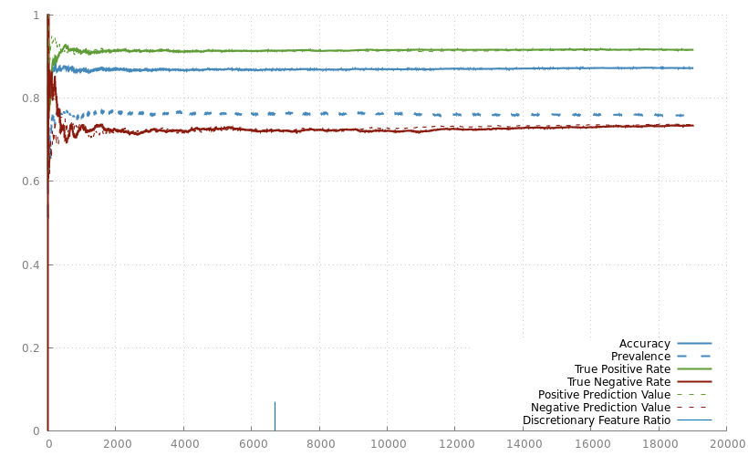
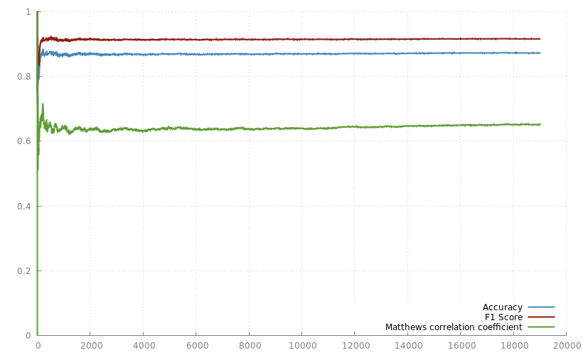
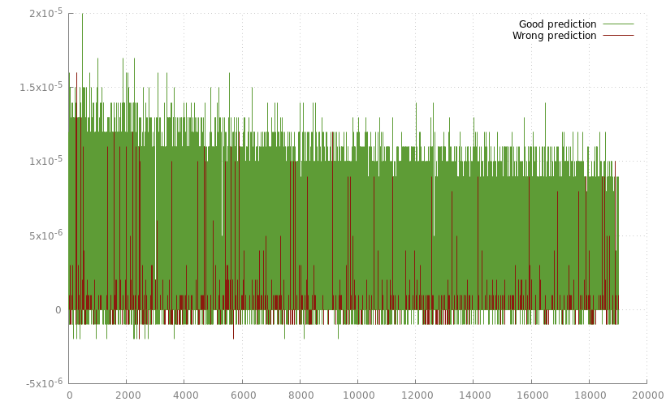
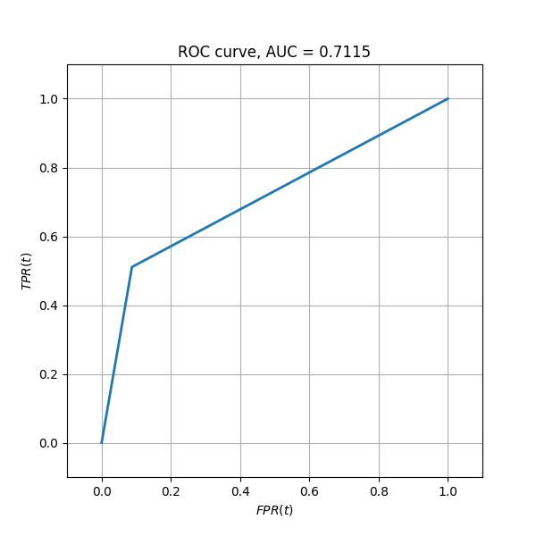

### Audiology

Confusion matrix:

|               | **Predicted 1**     | **Predicted 0**     |       |
| ------------- |:---------------:|:---------------:|:-----:|
| **Real 1**        | 56           | 1            |       |
| **Real 0**        | 0            | 22            |       |
| **Total**         | 56           | 23            | 79 |


Performances indicators:

|                           |        |
| ------------------------- |:------:|
| **Accuracy**              | 0.9873 |
| Prevalence                | 0.7089 |
| True positive rate        | 0.9565 |
| False positive rate       | 0.0175 |
| False negative rate       | 0.0435 |
| True negative rate        | 0.9826 |
| Positive predictive value | 1      |
| False discovery rate      | 0.0175 |
| False omission rate       | 0      |
| Negative predictive value | 0      |
| **F1 score**              | 0.9912 |
| Matthews corr. coef.      | 0.9694 |


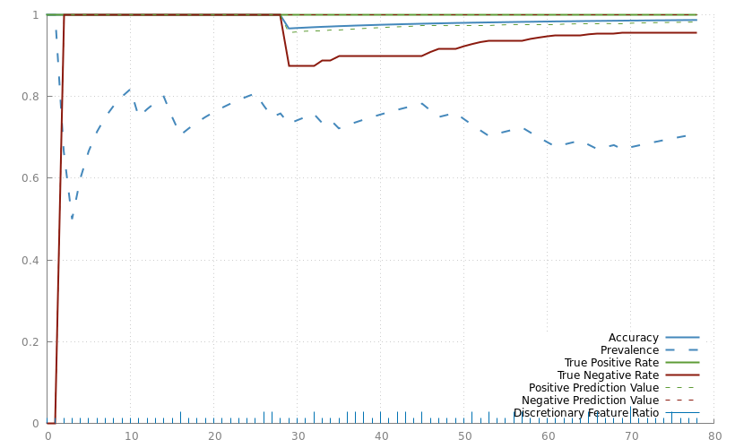
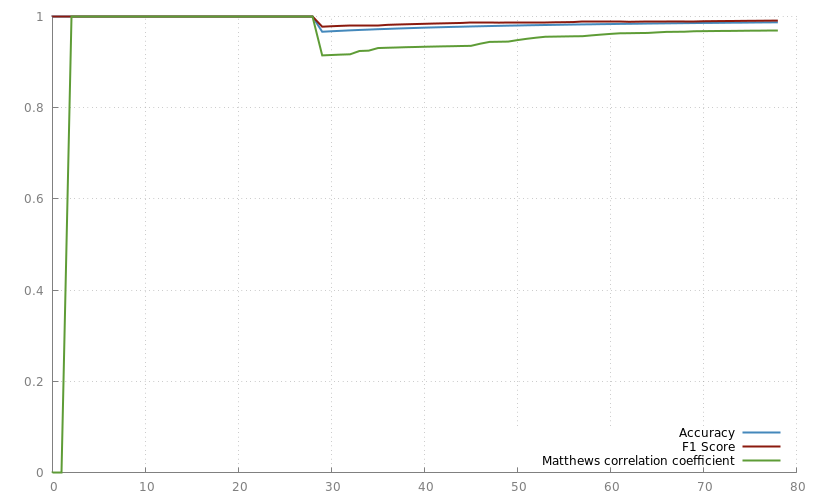
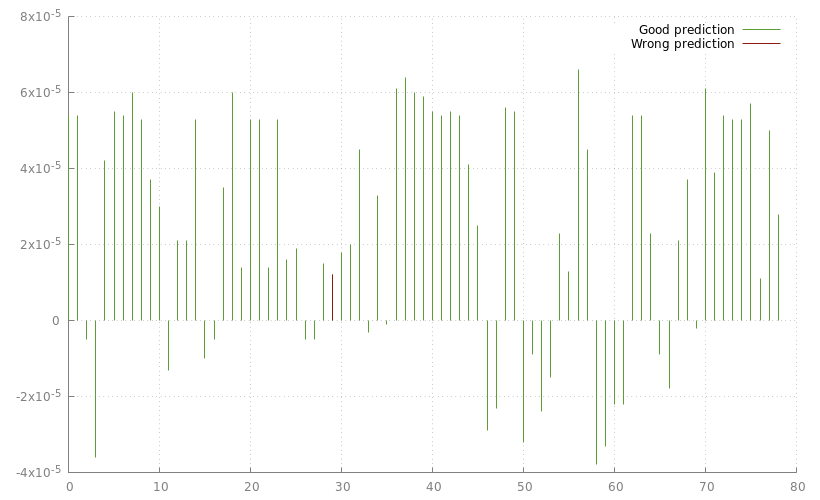
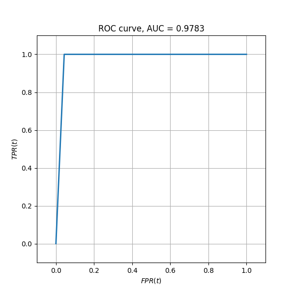

### Breast

Confusion matrix:

|               | **Predicted 1**     | **Predicted 0**     |       |
| ------------- |:---------------:|:---------------:|:-----:|
| **Real 1**        | 206           | 1            |       |
| **Real 0**        | 2            | 63            |       |
| **Total**         | 208           | 64            | 272 |


Performances indicators:

|                           |        |
| ------------------------- |:------:|
| **Accuracy**              | 0.9890 |
| Prevalence                | 0.7647 |
| True positive rate        | 0.9904 |
| False positive rate       | 0.0156 |
| False negative rate       | 0.0096 |
| True negative rate        | 0.9844 |
| Positive predictive value | 0.9952 |
| False discovery rate      | 0.0048 |
| False omission rate       | 0.0308 |
| Negative predictive value | 0.9692 |
| **F1 score**              | 0.9928 |
| Matthews corr. coef.      | 0.9696 |


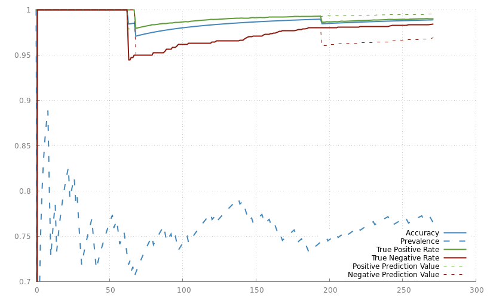
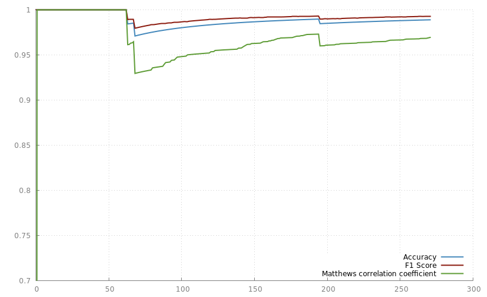

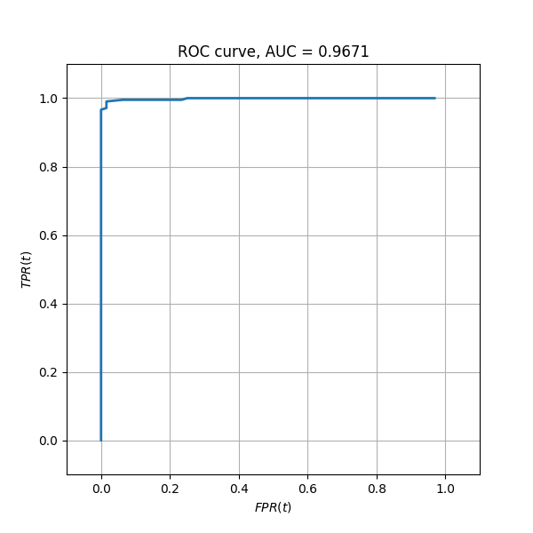

### Heart

Confusion matrix:

|               | **Predicted 1**     | **Predicted 0**     |       |
| ------------- |:---------------:|:---------------:|:-----:|
| **Real 1**        | 39           | 7            |       |
| **Real 0**        | 7            | 54            |       |
| **Total**         | 46           | 61            | 107 |


Performances indicators:

|                           |        |
| ------------------------- |:------:|
| **Accuracy**              | 0.8692 |
| Prevalence                | 0.4299 |
| True positive rate        | 0.8478 |
| False positive rate       | 0.1148 |
| False negative rate       | 0.1522 |
| True negative rate        | 0.8853 |
| Positive predictive value | 0.8478 |
| False discovery rate      | 0.1522 |
| False omission rate       | 0.1148 |
| Negative predictive value | 0.8852 |
| **F1 score**              | 0.8478 |
| Matthews corr. coef.      | 0.7331 |

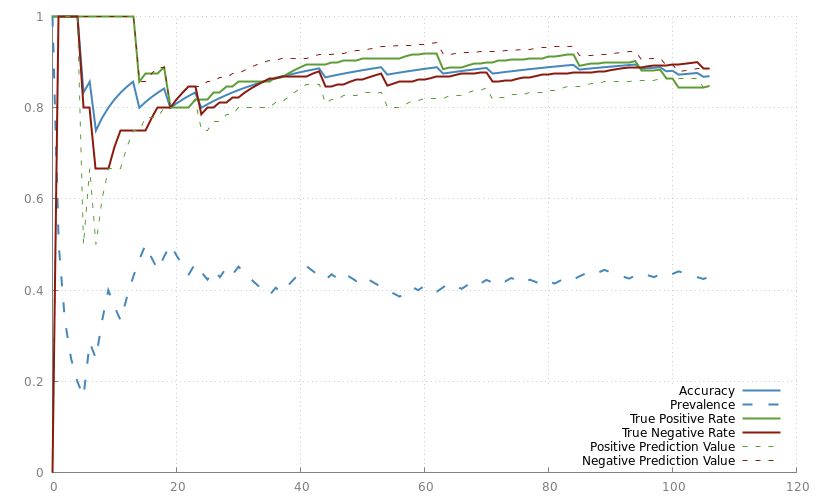
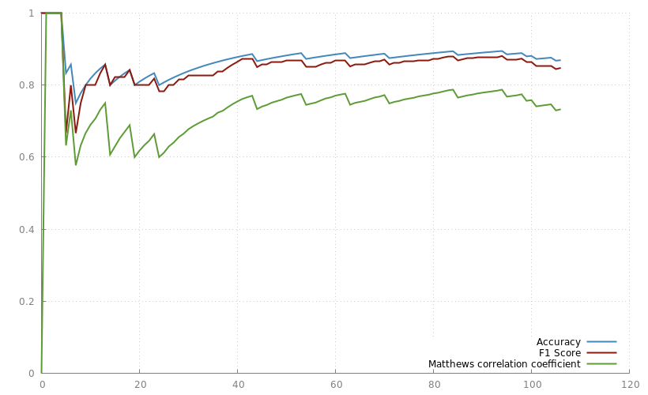

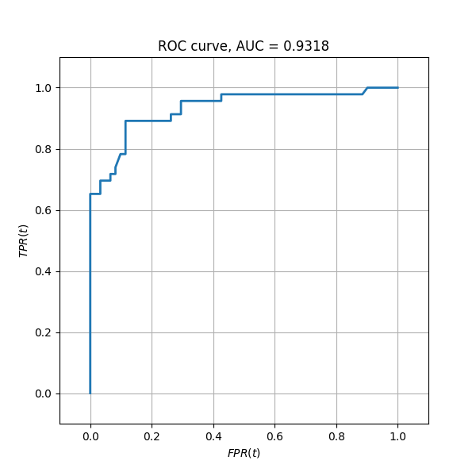

### Mushrooms

Confusion matrix:

|               | **Predicted 1**     | **Predicted 0**     |       |
| ------------- |:---------------:|:---------------:|:-----:|
| **Real 1**        | 2405           | 100            |       |
| **Real 0**        | 61           | 683            |       |
| **Total**         | 2466           | 783            | 3249 |


Performances indicators:

|                           |        |
| ------------------------- |:------:|
| **Accuracy**              | 0.9504 |
| Prevalence                | 0.7590 |
| True positive rate        | 0.9753 |
| False positive rate       | 0.1277 |
| False negative rate       | 0.0247 |
| True negative rate        | 0.8723 |
| Positive predictive value | 0.9600 |
| False discovery rate      | 0.0399 |
| False omission rate       | 0.0820 |
| Negative predictive value | 0.9180 |
| **F1 score**              | 0.9676 |
| Matthews corr. coef.      | 0.8627 |


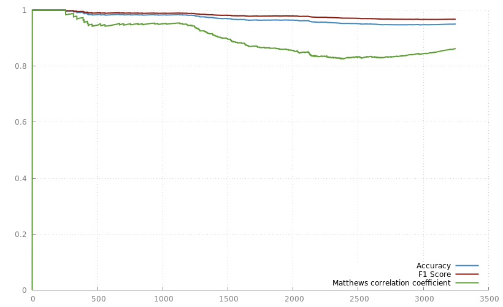
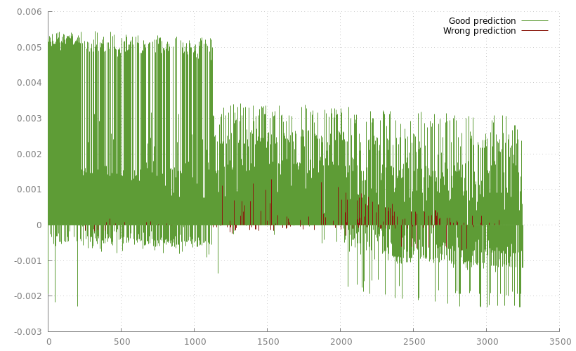
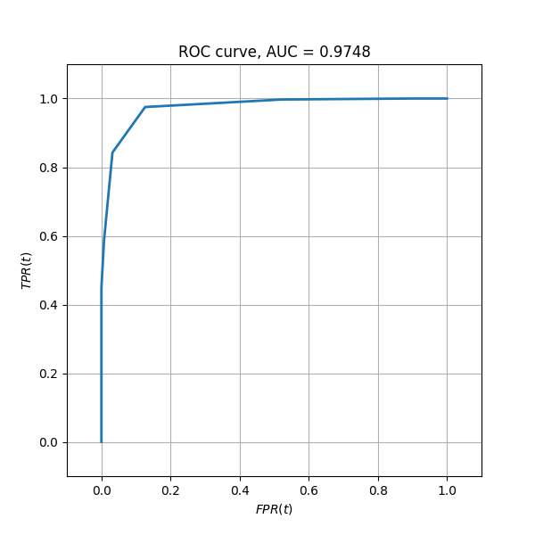

### Phishing

Confusion matrix:

|               | **Predicted 1**     | **Predicted 0**     |       |
| ------------- |:---------------:|:---------------:|:-----:|
| **Real 1**        | 2328           | 202            |       |
| **Real 0**        | 143           | 1748            |       |
| **Total**         | 2471           | 1950            | 4421 |


Performances indicators:

|                           |        |
| ------------------------- |:------:|
| **Accuracy**              | 0.9220 |
| Prevalence                | 0.5589 |
| True positive rate        | 0.9421 |
| False positive rate       | 0.1036 |
| False negative rate       | 0.0579 |
| True negative rate        | 0.8964 |
| Positive predictive value | 0.9202 |
| False discovery rate      | 0.0798 |
| False omission rate       | 0.0756 |
| Negative predictive value | 0.9244 |
| **F1 score**              | 0.9310 |
| Matthews corr. coef.      | 0.8415 |

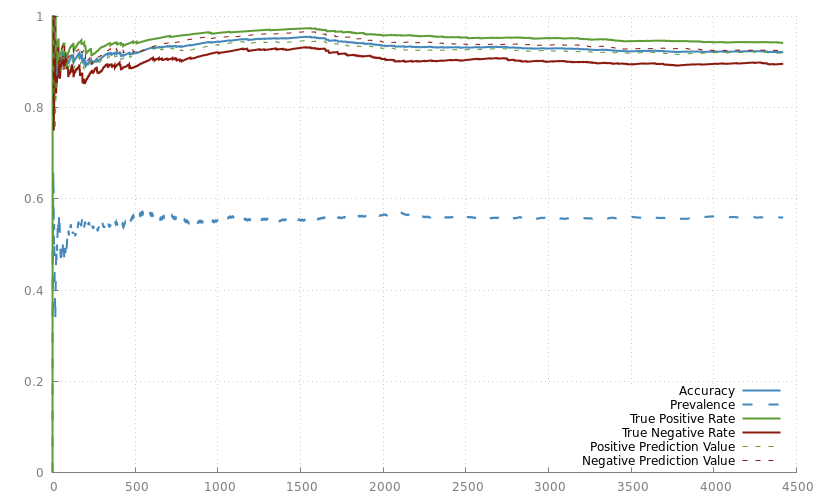
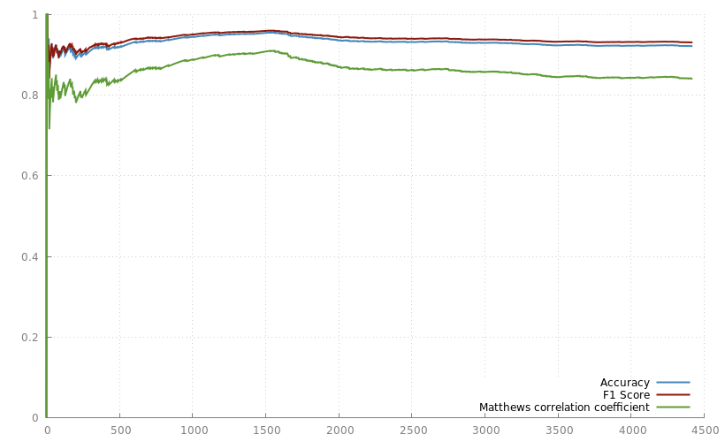
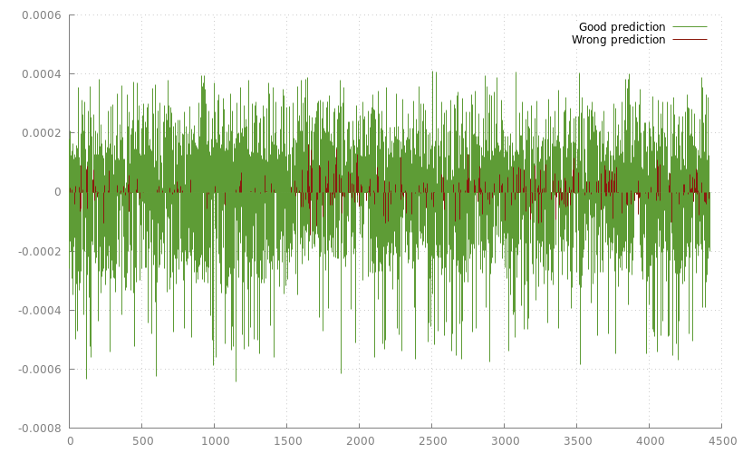
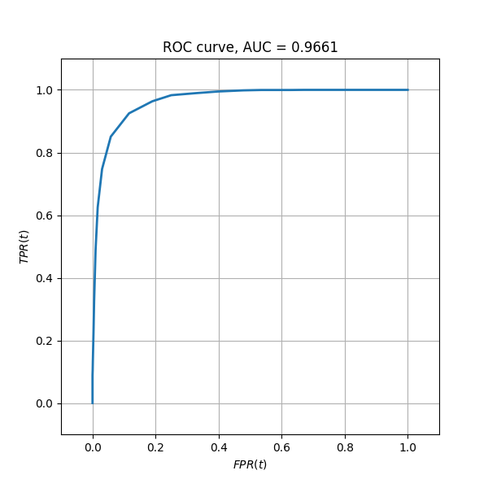

### Skin

Confusion matrix:

|               | **Predicted 1**     | **Predicted 0**     |       |
| ------------- |:---------------:|:---------------:|:-----:|
| **Real 1**        | 18777           | 870            |       |
| **Real 0**        | 1616           | 76759            |       |
| **Total**         | 20393           | 77629            | 98022 |


Performances indicators:

|                           |        |
| ------------------------- |:------:|
| **Accuracy**              | 0.9746 |
| Prevalence                | 0.2080 |
| True positive rate        | 0.9208 |
| False positive rate       | 0.0112 |
| False negative rate       | 0.0792 |
| True negative rate        | 0.9888 |
| Positive predictive value | 0.9557 |
| False discovery rate      | 0.0443 |
| False omission rate       | 0.0206 |
| Negative predictive value | 0.9794 |
| **F1 score**              | 0.9379 |
| Matthews corr. coef.      | 0.9222 |


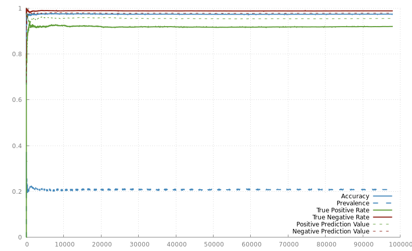
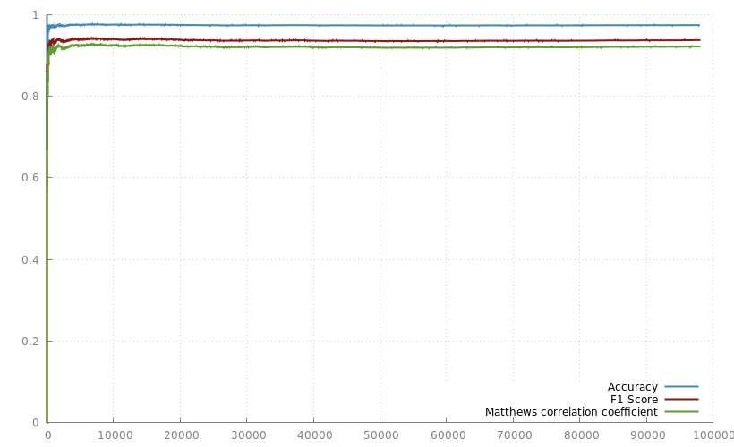
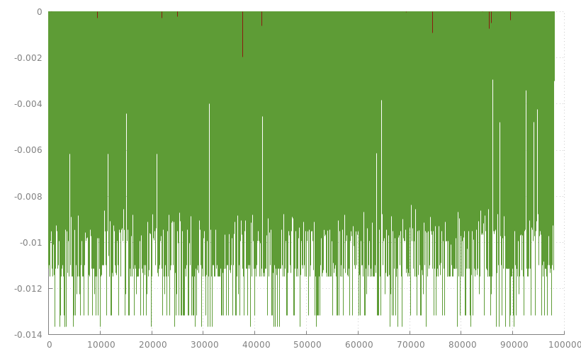
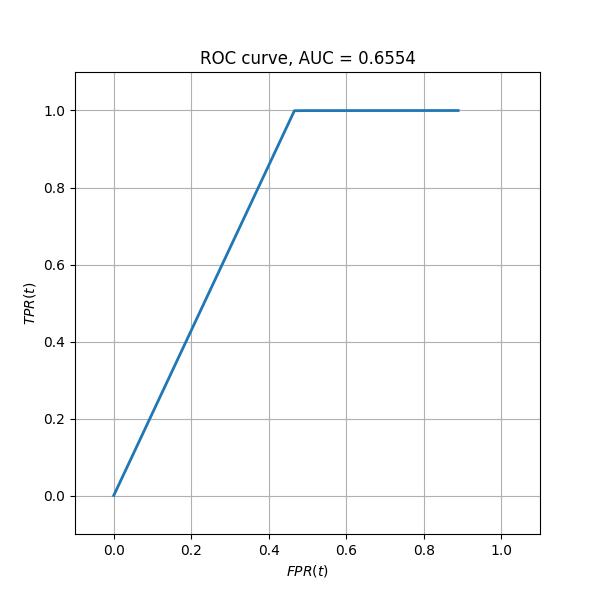

### Splice

Confusion matrix:

|               | **Predicted 1**     | **Predicted 0**     |       |
| ------------- |:---------------:|:---------------:|:-----:|
| **Real 1**        | 612           | 22            |       |
| **Real 0**        | 40           | 595            |       |
| **Total**         | 652           | 617            | 1269 |


Performances indicators:

|                           |        |
| ------------------------- |:------:|
| **Accuracy**              | 0.9511 |
| Prevalence                | 0.5138 |
| True positive rate        | 0.9387 |
| False positive rate       | 0.0347 |
| False negative rate       | 0.0613 |
| True negative rate        | 0.9643 |
| Positive predictive value | 0.9653 |
| False discovery rate      | 0.0347 |
| False omission rate       | 0.0630 |
| Negative predictive value | 0.9794 |
| **F1 score**              | 0.9518 |
| Matthews corr. coef.      | 0.9027 |


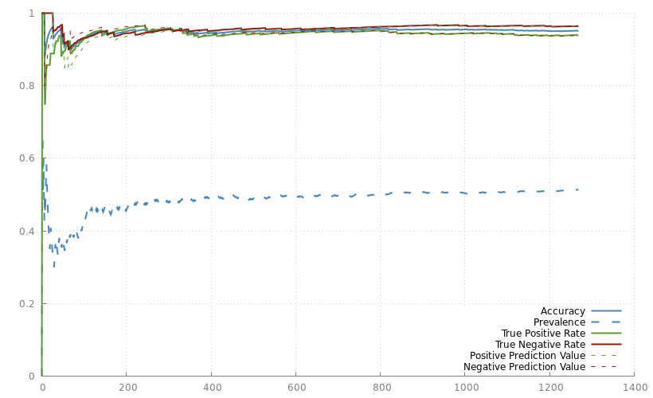
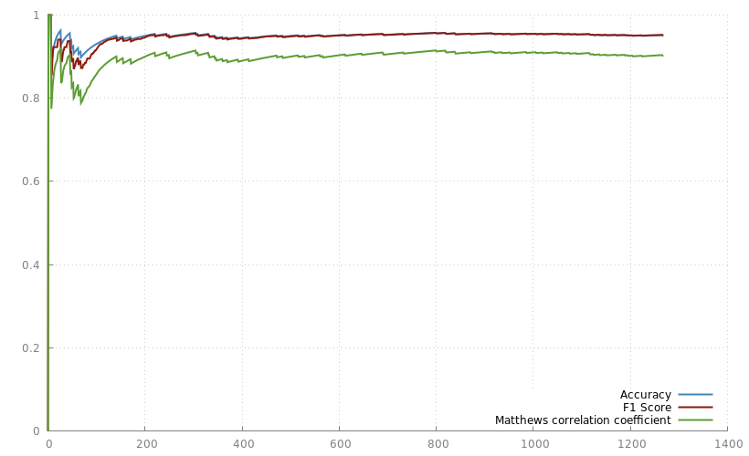
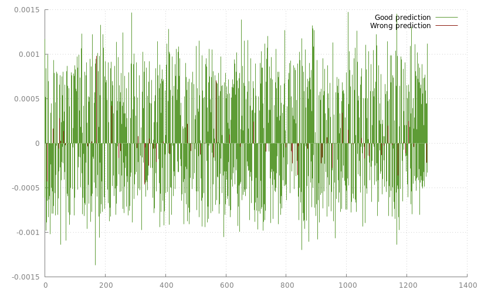
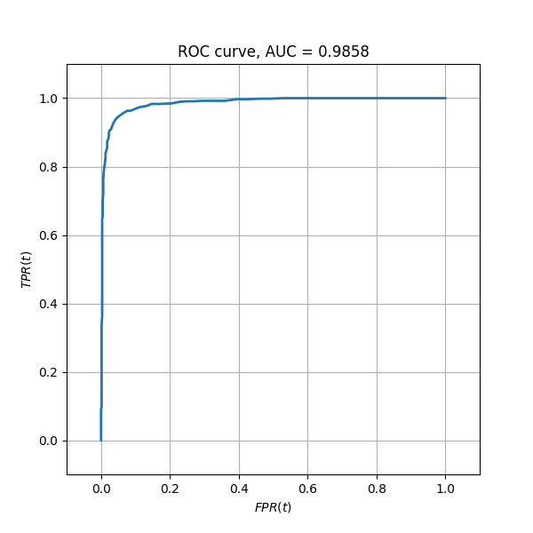